<h1 align="center">Book Keeper - iOS App</h1>

**Book Keeper** is a sleek iOS app in SwiftUI designed to help you discover and manage a wide variety of public domain books. The app fetches book data from the [Gutendex API](https://gutendex.com/), allowing you to browse, view detailed information, and even download or open books directly on your device. It's a great way to explore the world of free, public domain literature.

## Features

- **Book List Display**: View a comprehensive list of all available books fetched from the [Gutendex API](https://gutendex.com/).
- **Book Details**: Tap on a book to view detailed information such as title, author, and description.
- **Open or Download**: A button in the book detail view allows you to open the book in your browser or download it directly to your mobile device.
- **User-Friendly Interface**: A clean, easy-to-navigate interface that makes it simple to explore and manage your book collection.

## Installation

To run this project locally:

1. Clone the repository:
    ```bash
    git clone https://github.com/deepanshubajaj/BookKeeper-iOSApp.git
    ```

2. Open the project in Xcode:
    ```bash
    open BookKeeper.xcodeproj
    ```

3. Build and run the app on a simulator or physical device.

> Ensure you have Xcode installed and properly configured to run the project.

## API Reference

- **Gutendex API**: The book data for this app is fetched from the [Gutendex API](https://gutendex.com/). This API provides access to a large collection of public domain books, including metadata such as authors, languages, subjects, and more.
  
- **API Endpoint**: You can query books using various parameters such as title, author, or language. The API is designed to be straightforward to use and offers a variety of ways to filter and explore books. For more details on the API's capabilities, visit the [Gutendex API Documentation](https://gutendex.com/docs/). 

- In project : " https://gutendex.com/books "

- **Project Usage**: The app calls the API to fetch book data without requiring an API key, as the Gutendex API is free and open to the public. Simply interact with the API using its endpoints to retrieve book information and display it in your app.

## App Look

<p align="center">
  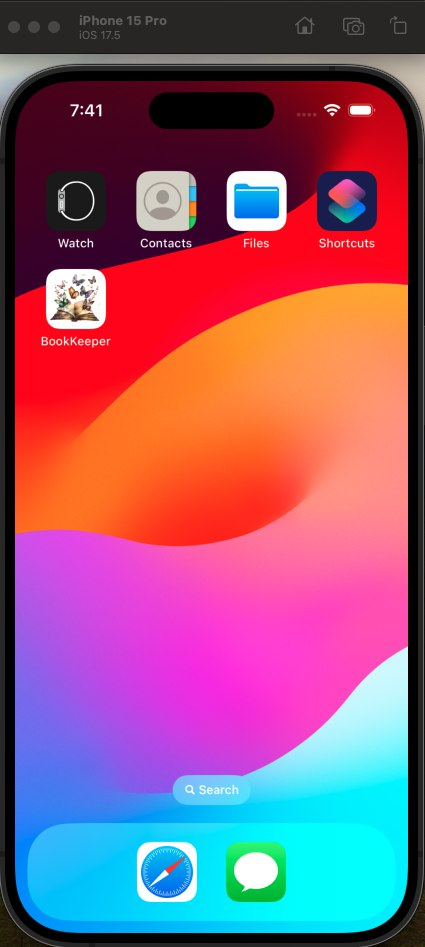
</p>
<p align="center">
  *App snapshot in the simulator.*
</p>

## Screenshots

<p align="center">
  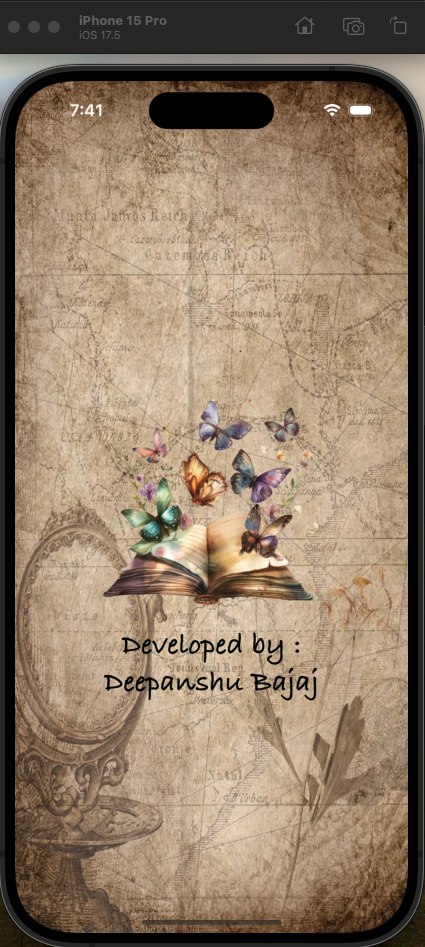
</p>
<p align="center">
  *Splash screen displayed upon app launch.*
</p>

<p align="center">
  <div style="display: flex; justify-content: center; gap: 10px;">
    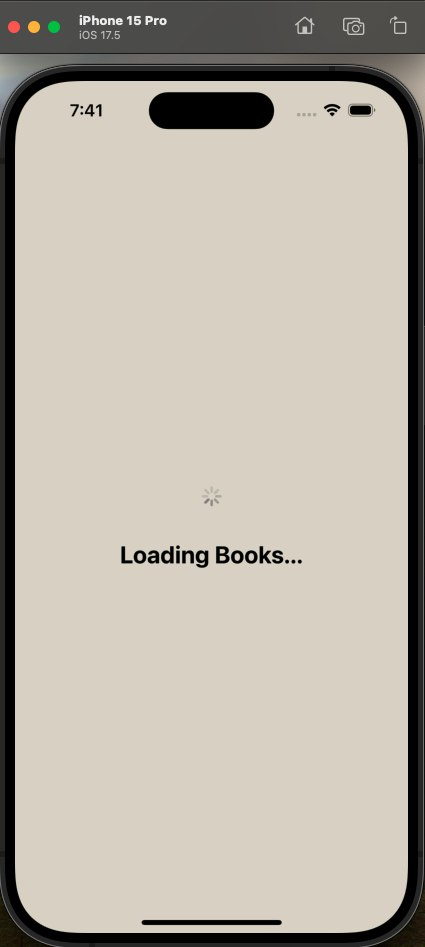
    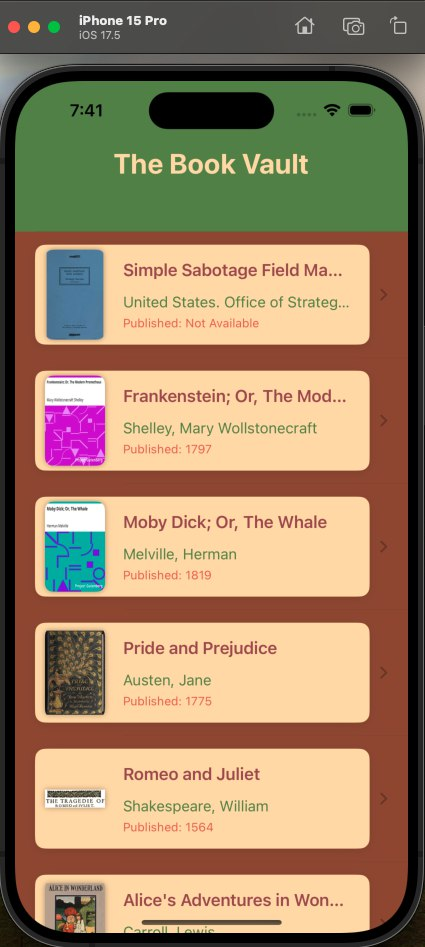
    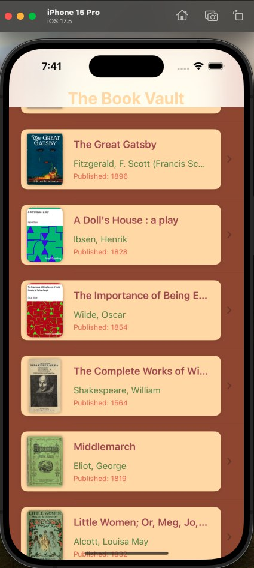
  </div>
</p>

<p align="center">
  <div style="display: flex; justify-content: center; gap: 10px;">
    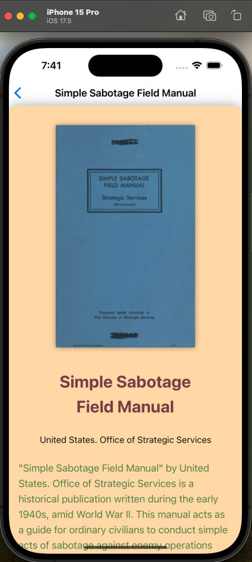
    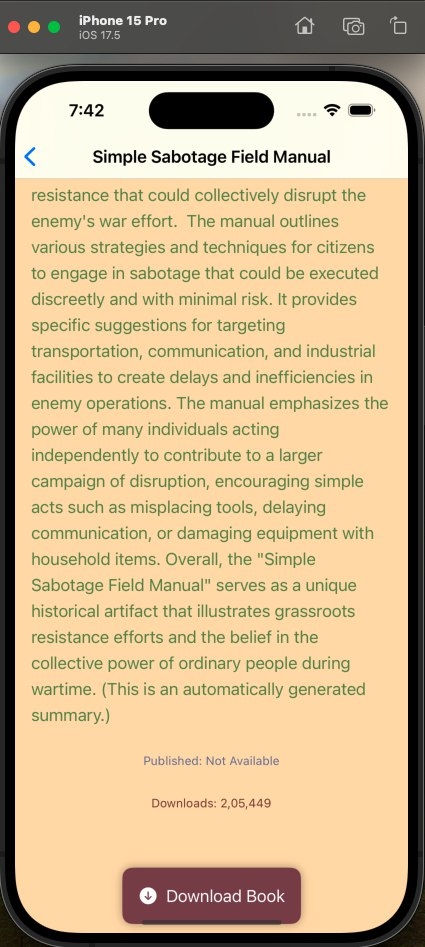
    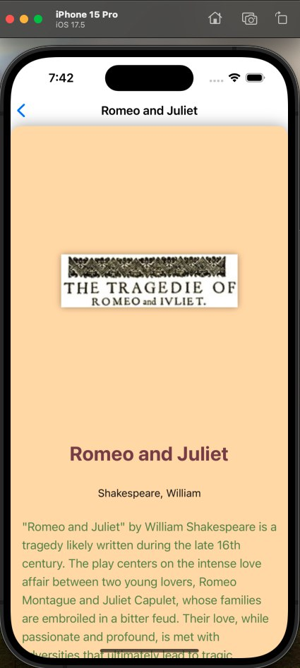
  </div>
</p>

<p align="center">
  <div style="display: flex; justify-content: center; gap: 10px;">
    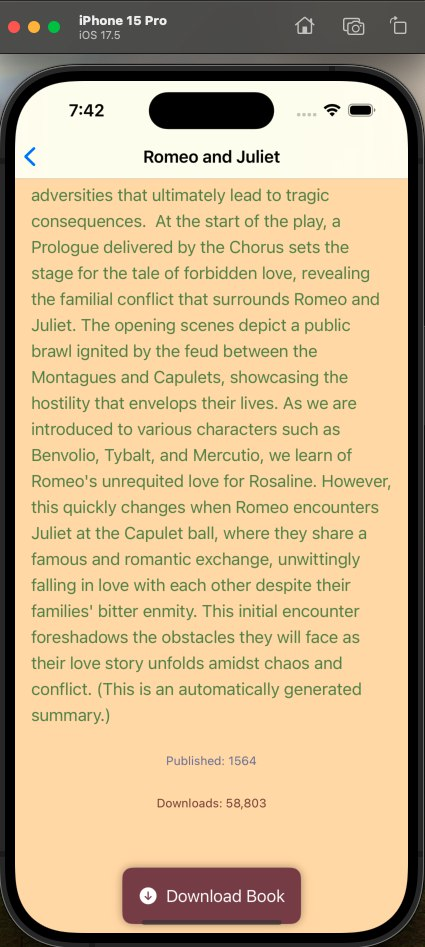
    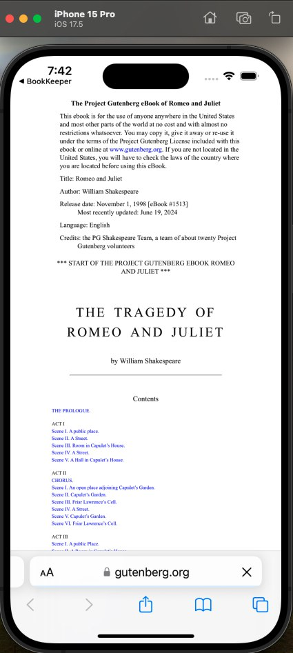
    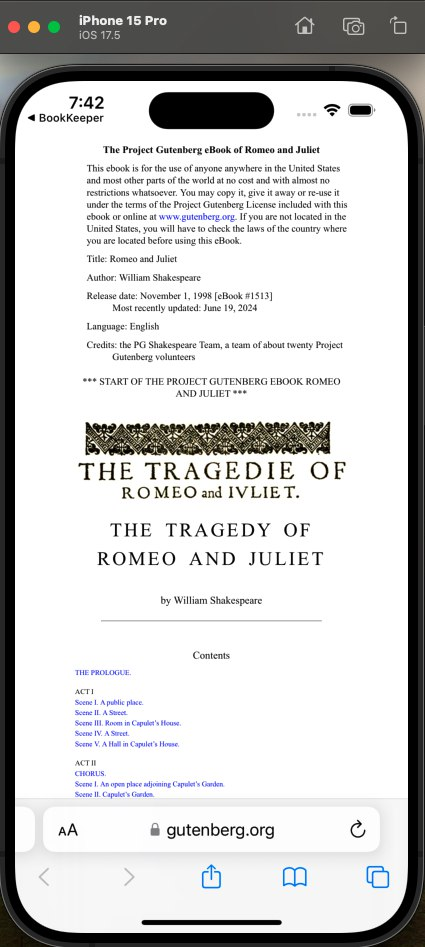
  </div>
</p>

<p align="center">
  *Screenshots of the Book Keeper app showing different stages of browsing and interacting with books.*
</p>

## App Icon

<p align="center">
  
</p>
<p align="center">
  *The app icon reflects the modern and book-centric theme of the Book Keeper app.*
</p>

## Video Demo

Here’s a short video showcasing the app's functionality:

<p align="center">
  
</p>

[Watch Working Video](ProjectOutputs/WorkingVideo/workingVideo.mov)

